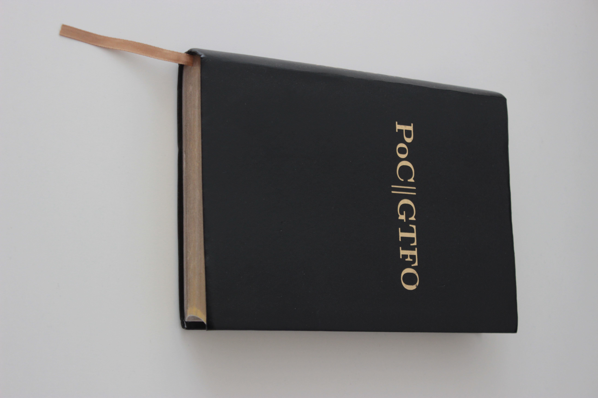

Title: PoC||GTFO Book Review
Date: 2020-05-30 22:20
Category: reviews
Tags: review, hacking, poc
Slug: PoC review
Authors: 0x00
Summary: Short review of the printed version from the PoC gang.

# PoC||GTFO Volume I & II

This review is some of the very first ones I ever wrote. I've reviewed several academic papers, seminar works etc. But never actually reviewed a book. But in my bookshelf are several titles that I just want to highlight, as I think the are really worth reading.

PoC GTFO Volume 1             |  PoC GTFO Volume 2
:-------------------------:|:-------------------------:
  |  

So PoC||GTFO is actually a online journal/zine$^1$ that you can find online. In some kind it reminds me on zines like phrack or 2600 but quirkier (in a positive way). Why there are quirkier? Because the introduction and style imitates a cliche bible from the United States (as well as some of the article do). So in some way it is like a bible for geeks that are interested in all kinds of weird machines, cryptography, operating systems, file type polyglots, hardware and of course security and hacking. A lot of the authors a really well know and have a high status in the it security scene.

So why mention a dead tree version, if you can read the issues online anyway? Because they are done so nicely. No starch press$^2$ did a fine job. And if you enjoy reading real books as I do, it is great that such things are exiting even in your domain. Often books are more or less just books, where content is everything. But sometimes a good printing or nice cover will upgrade the "joy of reading". And these both volumes are quite amazing and are fun to read. 

 The first real cool thing is that both volumes are leather-bound, which was some kind of a nice surprise. I read over this part of course as I ordered the book... The first volume comes black leather with a nice gold edge (in German "goldener Buchschnitt") and looks total fancy - but people will certainly look what you are reading, if you use the public transportation system as I do. This volume contains the first eight issues of PoC||GTFO. The second volume has a green leather-bound and comes with some PCB layout on its edge - cool! It contains the issues from nine to thirteen (including).

 While reading the PoC||GTFO volumes it is so amazing to read about thing you heard of but in different context or even never heard of, as they are from another era of computing or just totally specialized. But the most important thing is that it touches a certain depth (level of detail) and shows an impact on actual systems. They often sound total esoteric like, why should someone investigate or bother about it. But then you see the PoC and for me I just connect those proofs to things I do know or can rely to. If it is an article about stuff I never heard of but it sound interesting I dig into to until I can relate something to it and keep reading. So if one want to read these amazing books you will learn so much from it.

In between all these nerdy things there is more to discover. The issues are covered with often times strange advertisements and promotion stuff that doesn't come from industry. They come from the authors itself and often are very funny or interesting. Most times the look like they come from a very different time or universe. Geek-Level +1... I just love this kind of (art) work! 

As a total nerdy speciality this zine has lots of articles about file polyglots and therefore the PDF version of PoC||GTFO is a ployglot itself. Funny things like the PDF has an complete operating system included are standard and not the top of their work. Have a look at the file sizes and play around with tool like  binwalk and hexdump. There can be tons of thing discovered that are not only amusing but often teach something (yes, I look at you ECB mode :) )

As both volumes covers lots of articles I cannot review every single one of them. But I just thought to pick some of the articles and do some more research and write something about it. Maybe some will sometime read this and will have as 
much fun as I had reading them.

On several events like black:hat etc. these journals are distributes in print as well, but this collection is really enjoyable!

Links:

 1. One of the mirrors: <https://pocorgtfo.hacke.rs/>
 2. <https://nostarch.com/gtfo1> and <https://nostarch.com/gtfo2>
